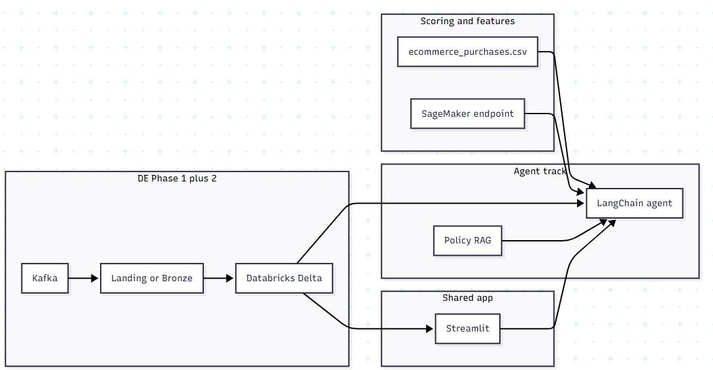

# Project 2 (Unified): Stream Analytics + Internal Business Agent

**Duration:** 2 weeks (group sprint)  
**Tracks:** Data Engineering ([Stream_Analytics_Phase_2.md](Stream_Analytics_Phase_2.md)), AI / Agent ([PROJECT_2_AGENT.md](PROJECT_2_AGENT.md))  
**Prerequisites:** A deployable SageMaker model and the feature story in [data/README.md](data/README.md); DE Phase 1 producing landing / Gold Zone output  

**What this doc is for:** A **north star** for the cohort—not a step-by-step build guide. You figure out **how** to implement; this describes **what** the program is trying to achieve. Agent/streamlit/policy detail lives in [PROJECT_2_AGENT.md](PROJECT_2_AGENT.md).

---

## 1. Purpose

Rough picture: events flow through your **Kafka / batch / Databricks** path; **Streamlit** is where **internal business users** (ops, support leadership, risk, etc.) see **metrics** and use an **agent** to **score** orders (SageMaker), **look up** features, and answer **policy** questions using the **Master Policy Compendium** (retrieval + citation—not made-up policy or scores). This is **not** a shopper-facing or consumer self-service chatbot.

**Collaboration:** DE and AI/ML **share one Streamlit app** so nobody ships a separate “business UI.”

---

## 2. Outcomes (directional)

- **DE:** Trustworthy **Databricks** marts and a path for the agent to get **order-level features** when you are ready.  
- **Agent:** **LangChain** agent + tools + **policy RAG** from the compendium.  
- **App:** **Chat + metrics** in Streamlit; many teams also surface **high-signal alerts** (e.g. risky scores or policy constraints) in the chat—**how** you do it is up to you, as long as alerts tie to **real model output** or **retrieved policy**, not pure LLM invention.  
- **Stretch:** New features, new targets, or extra endpoints—see [PROJECT_2_AGENT.md](PROJECT_2_AGENT.md).

---

## 3. Architecture (high level)

---

## 4. Planning together (start early—don’t over-spec day one)

Use the first days to **learn the stack** and **talk**: What does your **model** need per row? ([data/README.md](data/README.md)) What can **DE land** in week one vs later? Will lookup start from **file/DB** and move to **Databricks** when ready? Who owns **Streamlit** pages vs **SQL**? Jot answers in a README or doc and **revise** as you learn.

**Rough target:** Gold-level data (or a view) that can feed **the same features** your endpoint was trained on—**names and shapes are for your team to agree on** with help from the dataset readme. The [agent spec](PROJECT_2_AGENT.md) goes deeper on tools, Streamlit, and policy RAG.

**Databricks / Streamlit:** DE track details live in [Stream_Analytics_Phase_2.md](Stream_Analytics_Phase_2.md). Agent + policy details live in [PROJECT_2_AGENT.md](PROJECT_2_AGENT.md). Don’t duplicate those here—**coordinate** instead.

---

## 5. Data platform (DE) — pointer

**Databricks + Delta**, **Airflow**, **Databricks SQL** for metrics—see [Stream_Analytics_Phase_2.md](Stream_Analytics_Phase_2.md).

---

## 6. Cost awareness (rules of thumb)

- **SageMaker:** Don’t leave endpoints running longer than needed ([PROJECT_2_AGENT.md](PROJECT_2_AGENT.md)).  
- **Databricks:** Right-size warehouses/jobs; stop when idle.  
- **LLM/embeddings for policy:** Cache what you can; watch token spend.  

---

## 7. Cadence (suggestion only)

| Week | Rough focus |
|------|-------------|
| **1** | Everyone builds familiarity; MVP agent + lookup; DE pipeline toward Gold; first Streamlit shell. |
| **2** | Hardening, integration, demo prep, **cleanup** of cloud resources per cohort policy. |

Your instructor may adjust.

---

## 8. Presentation (~20 minutes)

Combined **~20 minutes** with your DE partners (confirm length with your instructor).

**Include:**

- **Architecture diagram** — The pipeline your team designed (Phase 1 through Databricks, Streamlit, and how the agent track connects).  
- **Demo** — Live or recorded; metrics, agent, integration—your emphasis.  
- **Collaboration** — Brief note on how DE and AI/ML worked together.

Agent-side demo ideas: [PROJECT_2_AGENT.md](PROJECT_2_AGENT.md).

---

## 9. Risks

| Risk | Hint |
|------|------|
| Scope creep | Ship a thin vertical slice first, then deepen. |
| Features don’t match training | Revisit [data/README.md](data/README.md) and your saved training notes. |
| Bill shock | Timebox demos; tear down endpoints/warehouses. |

---

## 10. Document map (Project 2)

| Document | Use it for |
|----------|------------|
| [PROJECT_2_MASTER.md](PROJECT_2_MASTER.md) (this file) | Vision, cadence, pointers |
| [Stream_Analytics_Phase_2.md](Stream_Analytics_Phase_2.md) | DE / Databricks build |
| [PROJECT_2_AGENT.md](PROJECT_2_AGENT.md) | Internal business agent, Streamlit, policy RAG |
| [data/README.md](data/README.md) | Dataset / feature columns |
